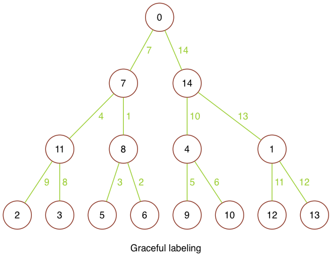

# Documentation

### Symmetric Star labeling

`#vlables` prints a matrix of node lables for a symmetric star

`#elables` prints a matrix of edge lables for a symmetric star

`#vlabel(j, i)` prints the *i<sup>th</sup>* node on the *j<sup>th</sup>* leg (or branch).

`#elabel(j, i)` prints the *i<sup>th</sup>* edge on the *j<sup>th</sup>* leg (or branch).

<!-- | Methods | Outpits |
|:--------|:-------------|
| `#vlables` | prints a matrix of node lables for a symmetric star |
| `#elables` | prints a matrix of edge lables for a symmetric star |
| `#vlabel(j, i)` | prints the *ith* node on the *jth* leg (or branch). |
| `#elabel(j, i)` | prints the *ith* edge on the *jth* leg (or branch). | -->

Example:

```ruby
star = SymmetricStarLabeling.new(6, 9)
star.print_vlabels
star.print_elabels(:blue)

puts "#{3}th branch, #{4}th vertex is #{star.vlabel(3, 4)}."

#=> all vertex labelings
54	45	36	27	18	9
1	10	19	28	37	46
53	44	35	26	17	8
2	11	20	29	38	47
52	43	34	25	16	7
3	12	21	30	39	48
51	42	33	24	15	6
4	13	22	31	40	49
50	41	32	23	14	5

#=> all edge labelings colored in terminal blue
54	45	36	27	18	9
53	35	17	1	19	37
52	34	16	2	20	38
51	33	15	3	21	39
50	32	14	4	22	40
49	31	13	5	23	41
48	30	12	6	24	42
47	29	11	7	25	43
46	28	10	8	26	44

# 3th branch, 4th vertex is 20.
```

### Graceful Symmetric Star

`::build(options)` is a factory method, which takes an options hash with keys:

| Options | Descriptions |
|:--------|:-------------|
| `legs` | the number of paths attached to the root node |
| `depth` | the number of nodes after the root to the bottom of the tree |

Example:

```ruby
star = SymmetricStar.build(legs: 7, depth: 3)
star.render #=> outputs png file with gracefully labeled (7, 3)-symmetric star
```


### Tree

`::build(options)` is a factory method, which takes an options hash with keys:

| Options | Descriptions |
|:--------|:-------------|
|`depth` | the number of nodes after the root to the bottom of the tree |
|`labeling` | an array of integers |

<br>
`#render(options = {})` takes a hash with keys:

| Options | Descriptions |
|:--------|:-------------|
| `name` | a string that will be appended to the name of the outputted png |
| `label` | a string that appears below the graph in the outputted png |

<br>
`::render_all_trees(size)`
- `size` - total number of nodes in each tree

`::render_graceful_trees(size, labelings)`

| Arguments | Descriptions |
|:--------|:-------------|
| `size` | total number of nodes in each tree |
| `labelings` | an array of potential graceful labelings (each of which is also an array) |

Example:

```ruby
# outputs a png with all trees on 4 vertices
Tree.render_all_trees(4)

# outpits a png with all graceful labelings of all trees on 4 vertices
labelings = (0..4).to_a.permutation.to_a
Tree.render_graceful_trees(4, labelings)
```

All graceful labelings of all trees on 4 vertices


All graceful labelings of all trees on 5 vertices

![5v_all][5v_all]

### Binary Tree

Example:

```ruby
# this is a graceful labeling for a binary tree on 15 nodes
labeling = [0, 7, 14, 11, 8, 4, 1, 2, 3, 5, 6, 9, 10, 12, 13]
btree = BinaryTree.build(depth: 3, labeling: labeling)
btree.render(name: "_graceful", label: "\nGraceful labeling")
```




[4v_all]: ./graph_images/4v_all.png
[5v_all]: ./graph_images/5v_all.png
